# 한국 주요 지표 분석 및 코스피 가격 예측
# 프로잭트 소개: 
이 프로젝트는 국가나 경제의 건강 상태를 파악하기 위해 사용되는 다양한 통계 지표의 상관관계를 보여주고 지표 변화에 따른 코스피 가격을 예측하는 프로젝트 입니다.

링크 : http://ec2-13-124-63-236.ap-northeast-2.compute.amazonaws.com:8506/

## 사용 라이브러리
streamlit, pandas, plotly, datetime, seaborn, matplotlib,joblib

## 자료 출처
https://ecos.bok.or.kr/#/

## 순서 
## 1. 데이터 수집
https://ecos.bok.or.kr/#/ 사이트에서 필요한 지표를 다운로드 했습니다.

## 2. 데이터 가공
다운로드한 지표들을 데이터프라임을 google colab 에서 합쳤습니다.
지표 Dataframe을 합치는 과정에서 몇몇 데이터는 인덱스가 워커데이(Workday) 형식으로 돼있고 몇몇은 달(month) 형식으로 돼있어서 합치는데 어려움이 있었습니다.

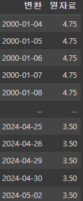   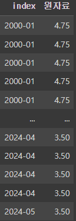

데이터를 합치기위해 workday 데이터의 index와 month 데이터의 index를 통일시키고 기존 index를 따로 빼놨습니다.
month 데이터는 영어로된 날짜 형태에서 workday의 날짜 형태로 index를 바꿔줬습니다.

wokday

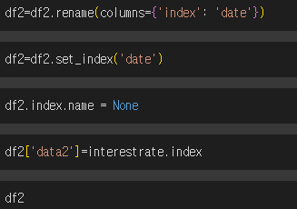    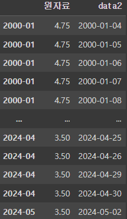

month  

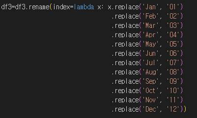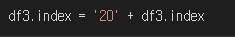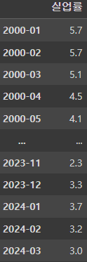

다른 데이터들도 month 데이터의 index로 합친 후 따로 뺴두었던 workday의 index로 변환시켜줬습니다.

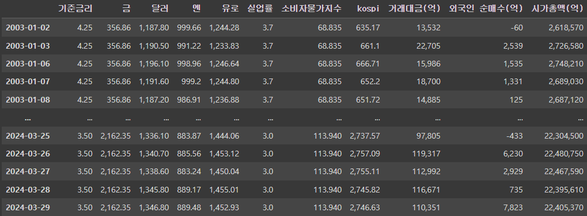

## 3. ML학습

가격 예측을 하기위해 파이썬에서 머신러닝 및 데이터 분석을 위한 라이브러리인 사이킷런(scikit-learn)패키지에서 제공하는 선형회귀 모델인 "LinearRegression"을 사용하고  사이킷런의 'train_test_split'를 활용하여 데이터셋을 훈련용과 테스트용으로 나눴습니다. 훈련용과 테스트용으로 나눈 이유는 모델을 훈련할 떄 사용되는 데이터와 모델을 펴앗할 떄 사용되는 데이터를 분리하여 모델의 성능을 정확하게 측정하기 위함입니다.

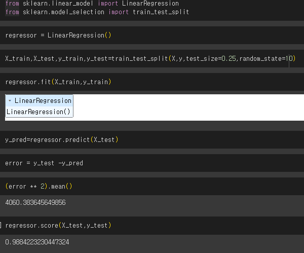

## 4. 서버 구현

visualstudio streamlit 프레임워크 기반으로 만들었습니다.

## 5. 기능

지표의 데이터를 보여주고 선택한 지표의 설명과 차트를 날짜를 지정하여 출력합니다.

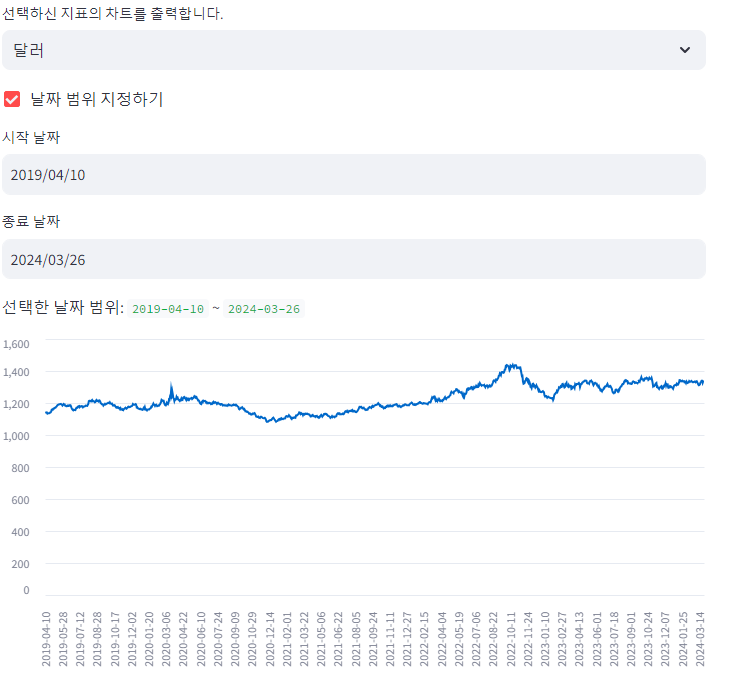

여러 지표를 선택하고 선택한 지표끼리의 상관관계를 출력합니다.

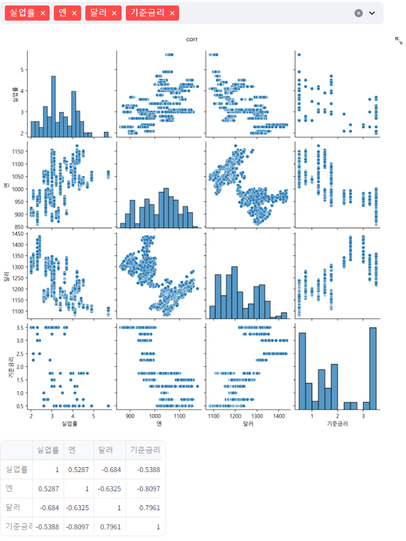

사용자가 지표의 수치를 직접입력하고 입력한 수치를 기반으로 코스피의 가격을 측정 할 수 있습니다.

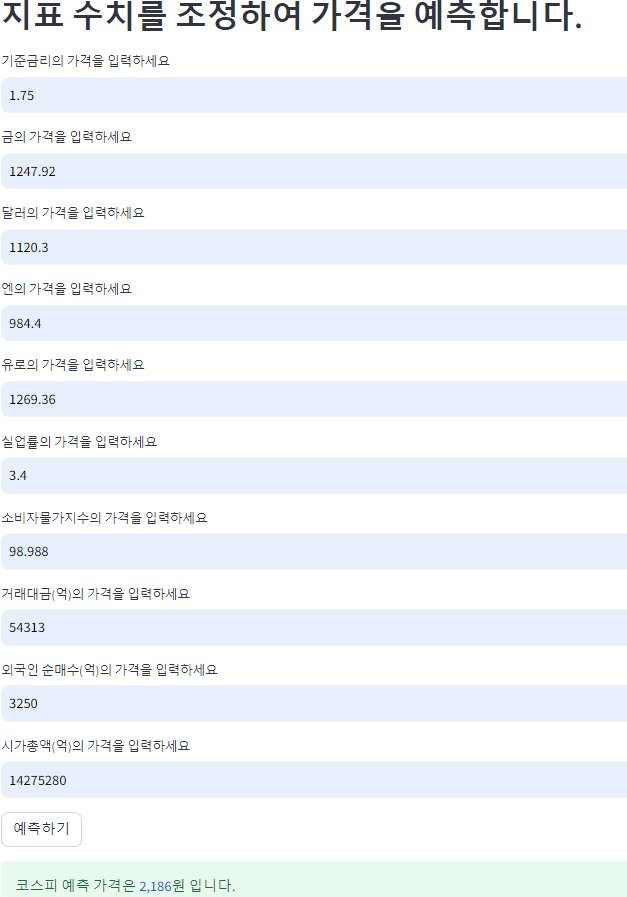

당일 지표 데이터를 사용자가 업로드하여 가격을 예측할 수 있습니다.

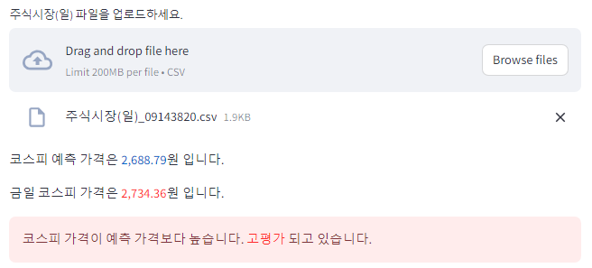

## 6.배포

작성한 코드 Gitgub 에 업로드합니다.

AWS EC2 활용했습니다.

PuTTY를 사용하여 EC2 인스턴스에 연결합니다.

Linux 환경에서 Gitgub에 코드를 clone 하여 가지고옵니다.

백그라운드로 서버를 실행하여 로컬에서 PUTTY를 종료해도 서버가 유지되게 했습니다.

## 7.배포 자동화

github action을 활용하여 코드를 수정해서 github에 업로드 하면 자동으로 Linux에서 git pull 할 수 있게 했습니다.

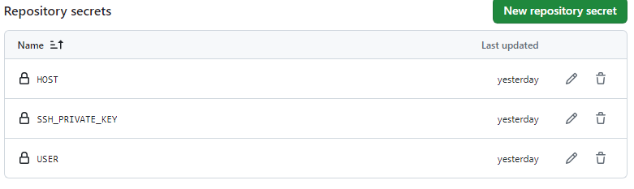

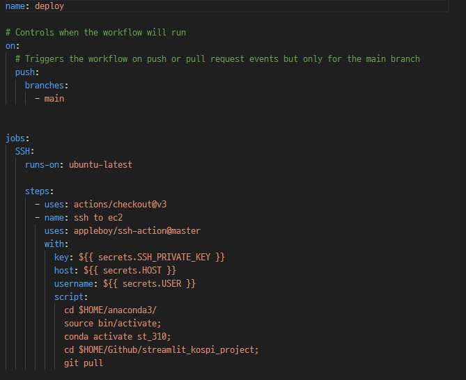

